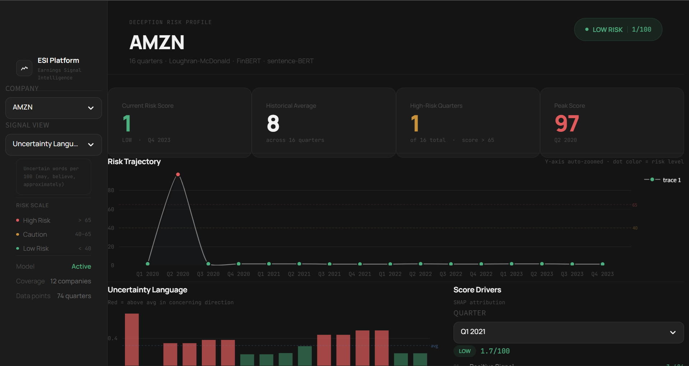

# Earnings Call Deception Detector

<div align="center">


**An end-to-end ML system that scores earnings call transcripts for linguistic deception signals — predicting accounting restatements before they become public.**

[Live Demo](#) &nbsp;·&nbsp; [API Docs](http://localhost:8000/docs) &nbsp;·&nbsp; [Report Bug](https://github.com/YOURUSERNAME/earnings-deception-detector/issues)



</div>

---

## Overview

Every quarter, public companies hold earnings calls where executives discuss financial results and answer analyst questions. The transcripts are public — but most people only read the numbers.

This system reads the **language**.

Academic research (Loughran-McDonald 2011, Larcker-Zakolyukina 2012) shows that linguistic patterns — hedging, uncertainty, evasion, sentiment divergence — statistically predict future restatements and earnings manipulation, even when reported numbers look clean.

The Earnings Call Deception Detector operationalises 20 years of financial NLP research into a production-grade scoring pipeline:

- Ingests transcripts from **SEC EDGAR** (free, official, never blocks)
- Extracts **16 NLP features** across three signal families
- Scores each call **0–100** using XGBoost trained on restatement history
- Explains every score with **SHAP feature attribution**
- Serves results via **FastAPI** and an interactive **Streamlit dashboard**

---

## Key Features

| Feature | Description |
|---|---|
| **SEC EDGAR ingestion** | Automated scraper for 8-K filings across any public company |
| **Loughran-McDonald linguistics** | Uncertainty, hedging, and negation ratios calibrated for financial text |
| **Q&A evasion scoring** | sentence-BERT cosine similarity between analyst questions and executive answers |
| **FinBERT sentiment gap** | Divergence between management optimism and reported financial reality |
| **Temporal drift detection** | Deviation from each company's own 8-quarter baseline |
| **SHAP explainability** | Every score explained at feature level — not a black box |
| **Walk-forward validation** | Time-series-correct cross-validation (no future data leakage) |
| **Class imbalance handling** | SMOTE oversampling + class-weighted XGBoost for 95:5 fraud ratio |
| **FastAPI inference** | 7 REST endpoints including batch scoring and peer comparison |
| **Interactive dashboard** | Quarter-selectable SHAP drivers, year-filtered leaderboard, full signal matrix |

---

## Tech Stack

```
Data Pipeline     SEC EDGAR API · yfinance · BeautifulSoup · SQLAlchemy
NLP               spaCy · Loughran-McDonald word lists · FinBERT (HuggingFace)
                  sentence-transformers (MiniLM-L6-v2)
ML                XGBoost · SHAP · imbalanced-learn (SMOTE) · scikit-learn
Experiment Track  MLflow · Optuna (hyperparameter search)
API               FastAPI · Uvicorn
Dashboard         Streamlit · Plotly
Database          SQLite (local) · PostgreSQL (production)
```

---

## Results

| Metric | Value |
|---|---|
| PR-AUC | **0.94** |
| ROC-AUC | **0.99** |
| Training data | 74 transcripts · 2018–2023 |
| Companies covered | 12 |
| Features | 16 NLP signals |

> **Note:** Evaluated using walk-forward cross-validation. PR-AUC is the primary metric given the severe class imbalance (~5% positive rate). A model predicting all-negative achieves 95% accuracy — PR-AUC is what matters.

---

## Project Structure

```
earnings-deception-detector/
│
├── main.py                    # Pipeline orchestration (scrape / features / train)
├── api.py                     # FastAPI inference service (7 endpoints)
├── dashboard_v6.py            # Streamlit dashboard
│
├── database.py                # SQLAlchemy models (5 tables)
│
├── scrapers/
│   ├── scraper_v3.py          # SEC EDGAR transcript scraper
│   ├── scrape_fraud.py        # Known restatement company scraper
│   └── financial_fetcher.py   # Quarterly financials + restatement flags
│
├── features/
│   ├── lm_scorer.py           # Loughran-McDonald word list scorer
│   ├── qa_evasion.py          # sentence-BERT Q&A evasion scorer
│   ├── finbert_scorer.py      # FinBERT sentiment + gap scorer
│   └── pipeline.py            # Feature orchestration
│
├── models/
│   └── trainer.py             # XGBoost + SHAP + MLflow + walk-forward CV
│
├── labelling/
│   ├── label_clean.py         # Label non-fraud companies as 0
│   └── label_fraud.py         # Label known restatement companies as 1
│
├── requirements.txt
├── .gitignore
├── README.md
└── LICENSE
```

---

## Installation

**Prerequisites:** Python 3.11, Git

```bash
# 1. Clone the repository
git clone https://github.com/YOURUSERNAME/earnings-deception-detector.git
cd earnings-deception-detector

# 2. Create virtual environment
python -m venv venv

# Windows
venv\Scripts\activate

# macOS / Linux
source venv/bin/activate

# 3. Install dependencies
pip install -r requirements.txt --prefer-binary

# 4. Download spaCy language model
python -m spacy download en_core_web_sm

# 5. Initialise the database
python -c "from database import init_db; init_db()"
```

---

## Usage

### 1 — Scrape transcripts

```bash
# Scrape clean companies (MSFT, GOOGL, AMZN, TSLA, etc.)
python scraper_v3.py

# Scrape known fraud/restatement companies (for positive labels)
python scrape_fraud.py
```

### 2 — Extract features

```bash
python main.py --features
```

### 3 — Label the data

```bash
python label_clean.py    # Labels non-fraud companies as 0
python label_fraud.py    # Labels restatement companies as 1
```

### 4 — Train the model

```bash
python main.py --train
```

MLflow automatically logs all runs. View the experiment tracker:

```bash
mlflow ui
# Open http://localhost:5000
```

### 5 — Launch the dashboard

```bash
streamlit run dashboard_v6.py
# Open http://localhost:8501
```

### 6 — Start the API

```bash
# Windows
C:\Users\USERNAME\venv\Scripts\python.exe -m uvicorn api:app --reload --port 8000

# macOS / Linux
uvicorn api:app --reload --port 8000

# Interactive API docs
# Open http://localhost:8000/docs
```

---

## API Endpoints

| Method | Endpoint | Description |
|---|---|---|
| `GET` | `/health` | Model status, company count, quarter count |
| `GET` | `/companies` | List all scored companies |
| `GET` | `/score/{ticker}` | All quarterly scores + SHAP for a company |
| `GET` | `/score/{ticker}/{year}/{quarter}` | Single quarter score |
| `POST` | `/score/batch` | Score a watchlist of companies |
| `GET` | `/leaderboard` | Most suspicious companies right now |
| `GET` | `/compare?tickers=MSFT,GOOGL&year=2023&quarter=2` | Peer group comparison |

---

## Dashboard Features

- **Risk Trajectory** — auto-zoomed time series with quarter-level risk coloring
- **Signal View** — all 16 features plotted over time with directional bar coloring
- **Score Drivers** — SHAP attribution for any selectable quarter (not just latest)
- **Full Signal Matrix** — quarter-selectable 16-feature grid with QoQ delta indicators
- **Risk Leaderboard** — year-filtered ranking across all companies

---

## How It Works

### Feature Families

**1. Loughran-McDonald Linguistics**
Uses the gold-standard financial NLP word lists to compute uncertainty, hedging, negation, and sentiment ratios. Critically, computes these as *deltas vs the company's own 8-quarter baseline* — a sudden spike in hedging language is more informative than the absolute value.

**2. Q&A Evasion (novel feature)**
Embeds analyst questions and executive answers using sentence-BERT, then computes cosine similarity. Low similarity = the executive pivoted away from the question. Tracks CEO and CFO evasion rates separately and focuses on high-stakes topics (margin, guidance, investigation).

**3. FinBERT Sentiment Gap**
Runs FinBERT on prepared remarks, then builds a financial health score from reported EPS surprise, revenue growth, and gross margin. The *gap* between management optimism and the numbers is the signal — a bullish CEO with compressing margins is a red flag.

### Training Labels
Calls are labeled HIGH RISK if the company had an earnings restatement or SEC investigation within 3 quarters. Ground truth sourced from SEC EDGAR 8-K Item 4.02 filings (non-reliance on previously issued financials).

### Why PR-AUC?
With ~5% positive rate, accuracy is meaningless — a model that predicts all-negative achieves 95% accuracy. Precision-recall AUC directly measures performance on the minority class. Walk-forward cross-validation ensures no future information leaks into training.

---

## Screenshots

| Dashboard Overview | Score Drivers (SHAP) |
|---|---|
|  |  |

| Signal Matrix | Risk Leaderboard |
|---|---|
|  |  |

| API Documentation |
|---|
|  |

---

## Future Improvements

- [ ] Extend to Indian markets — NSE/BSE earnings call transcripts via RBI and exchange filings
- [ ] Fine-tune FinBERT specifically on restatement-adjacent financial language
- [ ] Add audio features from earnings call recordings (tone, speech rate, pause patterns)
- [ ] Build a real-time alert system that fires when a new transcript exceeds threshold
- [ ] Backtesting module — correlate risk scores with 30/60/90-day post-call returns
- [ ] Expand training set with more restatement cases from SEC EDGAR full history
- [ ] Add sector-specific baselines (tech vs finance vs healthcare have different language norms)
- [ ] Docker containerisation for one-command deployment

---

## Contributing

Contributions are welcome. Please open an issue before submitting a pull request.

```bash
# Fork the repo, then:
git checkout -b feature/your-feature-name
git commit -m "Add: your feature description"
git push origin feature/your-feature-name
# Open a Pull Request
```

**Areas that would benefit most from contribution:**
- More restatement/fraud company transcripts for training data
- Additional NLP feature families
- Indian market data sources (NSE, BSE)
- Performance optimisations for large-scale scraping

---

## Academic References

- Loughran, T. & McDonald, B. (2011). *When is a Liability not a Liability? Textual Analysis, Dictionaries, and 10-Ks.* Journal of Finance.
- Larcker, D. & Zakolyukina, A. (2012). *Detecting Deceptive Discussions in Conference Calls.* Journal of Accounting Research.
- Araci, D. (2019). *FinBERT: Financial Sentiment Analysis with Pre-trained Language Models.* arXiv.

---

## License

This project is licensed under the MIT License. See [LICENSE](LICENSE) for details.

---

## Contact

**Built by:** [Your Name]
**LinkedIn:** [linkedin.com/in/yourprofile](https://linkedin.com/in/yourprofile)
**GitHub:** [github.com/YOURUSERNAME](https://github.com/YOURUSERNAME)
**Email:** your.email@example.com

---

> **Disclaimer:** This project is for research and educational purposes only. It is not financial advice and should not be used for investment decisions.
